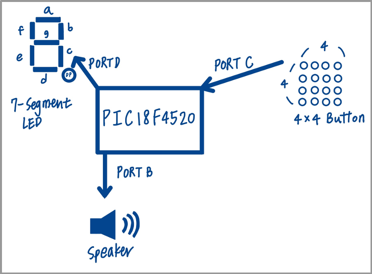
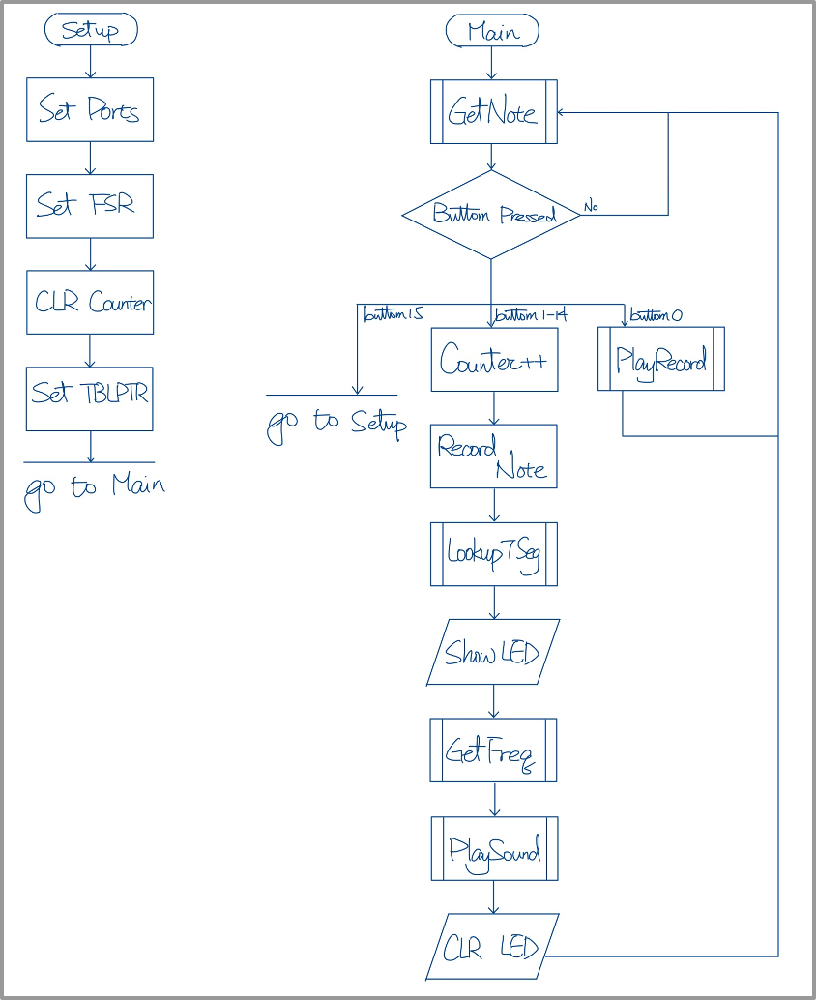
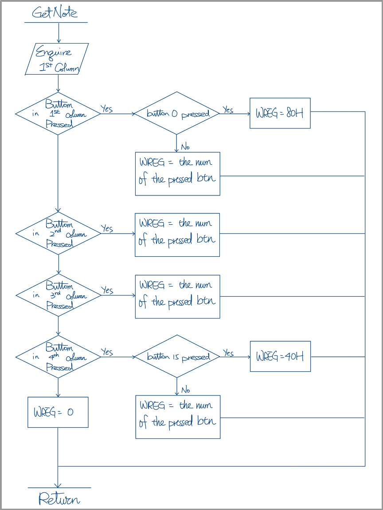
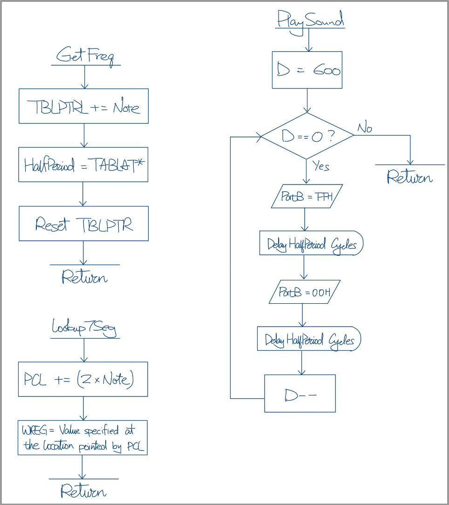
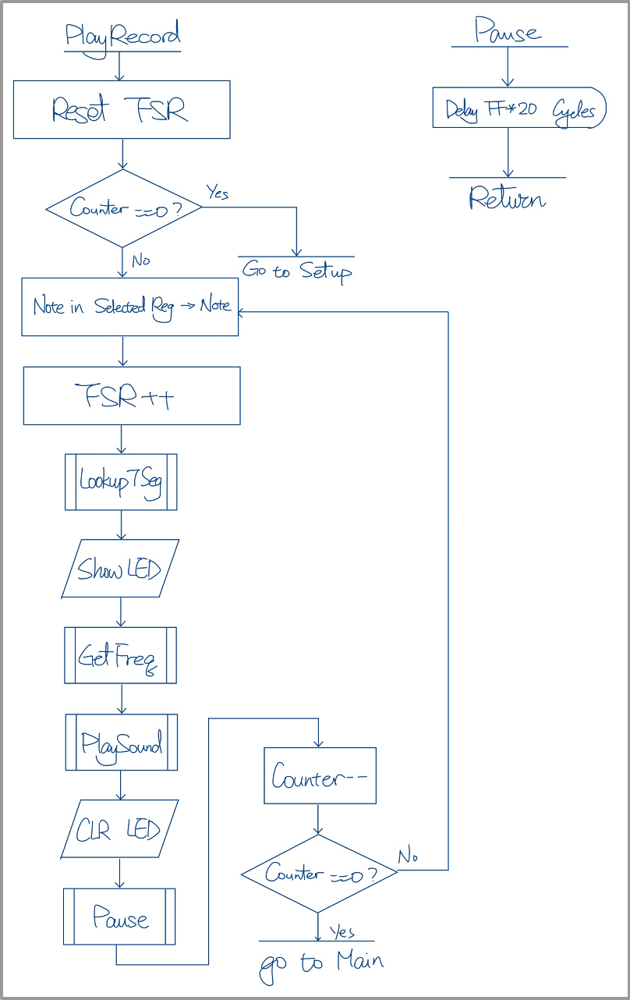

**Project Title**

A Digital Piano built with PIC18 MCU

**Project Description**

There are mainly three features of our design.

First, we use 4x4 bottoms, instead of just using the more basic 8
buttons, as the keys of the piano. The 4x4 buttons are connected to 8
pin output, therefore, we use time multiplexing to check which pin is
being pressed. The keys cover two completed octaves, a play button and a
clear button, which is used in the third function.

The second function is the note display in the 7-segment LED. By keeping
track of which button is pressed, we can find out what note is played
and show the corresponding note on the LED. The LED display not only
occurs when the button is pressed, but it is also turned on when the
recorded music is being played so that the people can know what notes
are pressed.

The third function is music recording and playing. Every time when music
is played, the buttons that are pressed are recorded. When the play
button is pressed, the speaker will output the music. The same music can
be played out several times by pressing the play button. When we want to
clear the previous record of the music and start to record a new song,
we can press the 'clear button' to delete all the previous record and
start a new one.

**System Architecture**

{width="5.171720253718285in"
height="3.8010422134733157in"}

Figure 1: System Architecture

**I/O Description**

1.  Input:

    a.  4x4 Button: connected to PORTC

2.  Output:

    a.  Play Music: PORTB

    b.  7-segment LED: PORTD

**Program Description**

{width="5.807292213473316in"
height="7.126123140857393in"}

Figure 2: Flow Chart of Main and Setup

{width="5.954438976377952in"
height="7.926041119860018in"}

Figure 3: Flow Chart of GetNote

{width="6.640625546806649in"
height="7.479166666666667in"}

Figure 4: Flow Chart of GetFreq, Lookup7Seg and PlaySound

{width="5.5625in" height="8.85in"}

Figure 5: Flow Chart of PlayRecord and Pause
